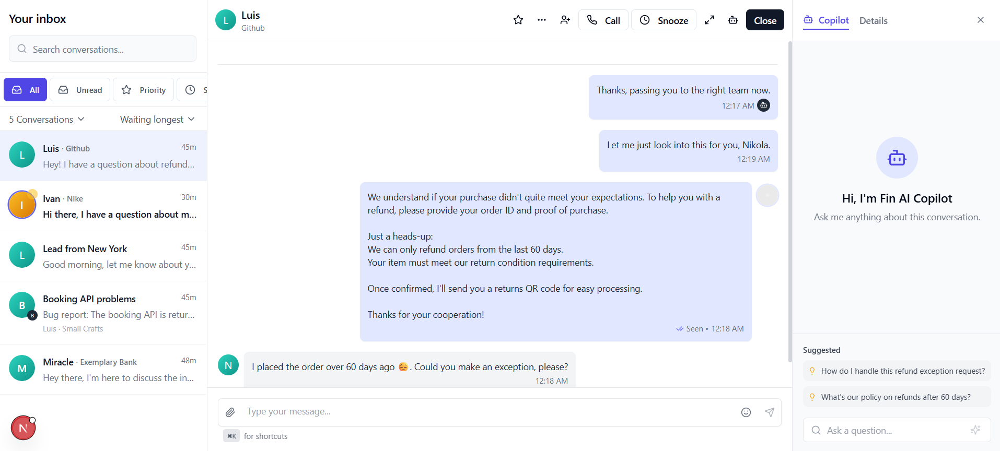

# Intercom Clone - High-Fidelity Customer Support Platform



A high-fidelity, feature-rich customer support platform inspired by Intercom. This application provides a modern, responsive interface for managing customer conversations with AI assistance.

🔗 **Live Demo**: [Intercom Chatbot](https://intercom-chatbot.vercel.app/)

## ✨ Features

- **Intuitive Inbox Management**: Easily manage and prioritize customer conversations
- **AI-Powered Copilot**: Get intelligent suggestions and assistance for customer inquiries
- **Real-time Chat Interface**: Smooth, animated chat experience with typing indicators
- **Responsive Design**: Fully optimized for both desktop and mobile devices
- **Dark Mode Support**: Complete dark mode implementation for all components
- **Rich Interactions**: Emoji picker, file attachments, and message reactions
- **Detailed Customer Information**: Access comprehensive customer data and conversation history

## 🛠️ Technologies

- **Next.js**: React framework for server-rendered applications
- **TypeScript**: Type-safe JavaScript for better developer experience
- **Tailwind CSS**: Utility-first CSS framework for rapid UI development
- **Framer Motion**: Animation library for smooth transitions and effects
- **Lucide Icons**: Beautiful, consistent icon set
- **shadcn/ui**: High-quality UI components built with Radix UI and Tailwind

## 🚀 Getting Started

### Prerequisites

- Node.js 18.x or later
- npm or yarn

### Installation

1. Clone the repository:
```bash
git clone https://github.com/yourusername/intercom-clone.git
cd intercom-clone
```

2. Install dependencies:
```bash
npm install
# or
yarn install
```


3. Run the development server:
```bash
npm run dev
# or
yarn dev
```

4. Open [http://localhost:3000](http://localhost:3000) in your browser to see the application.


## 📱 Usage

### Desktop Interface

The desktop interface is divided into three main panels:

1. **Conversation List**: Browse and filter your customer conversations
2. **Chat Interface**: Interact with customers in real-time
3. **AI Copilot**: Get AI-powered assistance and suggestions


### Mobile Interface

On mobile devices, the interface adapts to show one panel at a time with smooth transitions between:

- Conversation list
- Active chat
- AI copilot


### Key Features

- **Conversation Management**: Filter conversations by status (all, unread, priority, snoozed)
- **Message Actions**: Star conversations, snooze, assign to team members
- **AI Assistance**: Get suggested responses and helpful resources
- **File Sharing**: Send images, documents, audio, and video files
- **Emoji Support**: Add emojis to your messages with the built-in picker


## 🧩 Project Structure

```
intercom-clone/
├── app/                  # Next.js app directory
│   ├── layout.tsx        # Root layout component
│   ├── page.tsx          # Main page component
│   └── globals.css       # Global styles
├── components/           # React components
│   ├── ai-copilot.tsx    # AI assistant panel
│   ├── chat-interface.tsx # Chat interface component
│   ├── conversation-list.tsx # Conversation list component
│   ├── empty-state.tsx   # Empty state component
│   ├── inbox.tsx         # Main inbox component
│   ├── mobile-header.tsx # Mobile header component
│   └── ui/               # UI components from shadcn
├── hooks/                # Custom React hooks
│   └── use-mobile.tsx    # Hook for responsive design
├── types/                # TypeScript type definitions
│   └── index.ts          # Type definitions for the app
├── public/               # Static assets
└── README.md             # Project documentation
```

## 🎨 Customization

### Theming

The application uses Tailwind CSS for styling. You can customize the theme by modifying the `tailwind.config.ts` file:

- **Colors**: Update the color palette in the `theme.extend.colors` section
- **Typography**: Modify font settings in the `theme.extend.typography` section
- **Animations**: Adjust animation settings in the `theme.extend.keyframes` and `theme.extend.animation` sections


## 📄 License

This project is licensed under the MIT License - see the LICENSE file for details.

## 🙏 Acknowledgements

- [Intercom](https://www.intercom.com/) for inspiration
- [shadcn/ui](https://ui.shadcn.com/) for the beautiful UI components
- [Framer Motion](https://www.framer.com/motion/) for the smooth animations
- [Lucide Icons](https://lucide.dev/) for the icon set